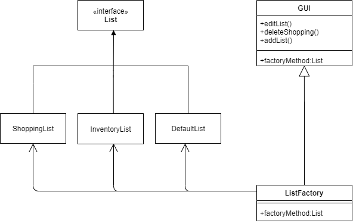
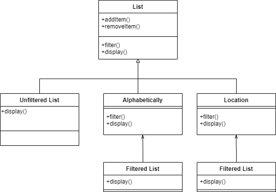

# CS 100 Programming Project

Group members:

	Christian Torres : ctorr016@ucr.edu

	Emily Mai : cmai007@ucr.edu

Title: Pantry to-go (tentatively)

App idea:
	This app will help keep track of what is in one's pantry, fridge, and freezer.
This will make shopping more effiecient by keeping track of what to buy and what one already has. 
Features will include filters: by expiration, item alphabetically, location, quantity, and category.

Importance: 
	Serves to remind you what you need and what you already have at home. Will make shopping more efficient and helps keep track of how much you are buying.

Language, tools, technology: 
	c++

Input/output:
Manual item input.
Generated list of items you have and items you need.

## Decorator:

Using a decorator diagram we will create a base class named item. This item will have at the very least a name and location. The location will be an enum(Freezer, Fridge, Pantry) while the name a string. The user can add an expiration date, quantity or category by their own descretion. getDescription() function will be a string that will output to the console the name, location and any of the decorators that were added.

	
## Factory:

Using a factory we will allow the client to be able to create a list of Item*. This will allow us to add, remove items on to any list. This will save the list into a seperate file which can be later edited. The client interface will have options to add a list, edit the default list, delete a list or generate a shopping list based on default and any list of the user's choosing.

## Composite

Using a composite design on the list that factory creates will allow us to add filtering to the list. This will allow us to filter via alphabetically, by location or a mix of the two. The class will have a vector where it will store the list. The base should display the list and the composite will be able to sort the list. The base class will have ways of adding or removing items. While the composite will only filter.

